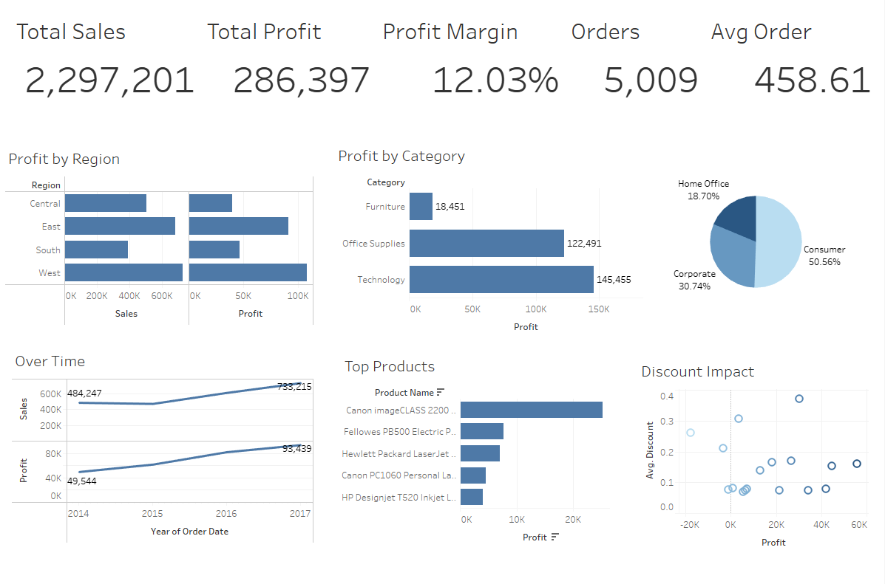

# Superstore Sales & Profit Analysis

Interactive Tableau dashboard exploring sales performance, profitability drivers, regional differences, category performance, and the impact of discounting using the Sample Superstore dataset.

## Project Overview
This project analyzes the Sample Superstore dataset to identify key profit leaks and provide actionable recommendations for improving margins.  

I performed initial exploratory data analysis and KPI calculations in Excel, then built an interactive dashboard in Tableau.

## Files Included
- **Superstore_Data.xlsx** – Raw data, PivotTables, and EDA  
- **Superstore_Dashboard.twbx** – Full interactive Tableau dashboard  
- **Superstore_Analysis_Report.pdf** – Detailed written report with insights and recommendations

## Tools Used
- Excel: Data cleaning, PivotTables, initial EDA  
- Tableau: Interactive visualizations and dashboard

## Key Insights
- Technology is the most profitable category while Furniture consistently loses money due to high discounts.  
- West region leads in sales and profit; Central region significantly underperforms.  
- Discounts above 30% strongly correlate with losses.

## Recommendations
- Cap discounts on low-margin categories (especially Furniture).  
- Focus promotions on Technology products in high-performing regions.

## Dashboard Preview

